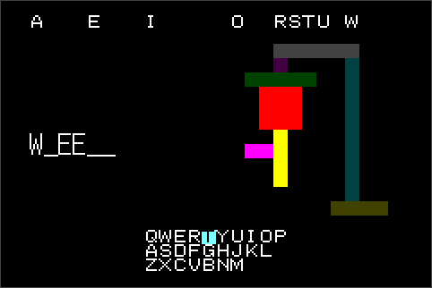

hangman
=======

Overview
--------

A simple hangman game for Gameboy Advance.

Dependencies
------------

Build-time dependencies:

- (host) gcc
- (host) binutils
- (host) libc
- freetype2
- arm-none-eabi- gcc
- arm-none-eabi- binutils
- GNU Make

Build instructions
------------------

.. code::

   make

This will create ``main.gba`` which can be loaded on many Gameboy Emulators or
burned to a physical rom cartridge.

Emulator/hardware compatibility
-------------------------------

hangman is known to work well on at least:

- mGBA (Linux/Windows/macOS)
- VBA-M
- Nintendo DS (original hardware)
- Game Boy Advance (original hardware)
- open_agb_firm (Nintendo 3DS)
- mGBA (Nintendo Switch)
